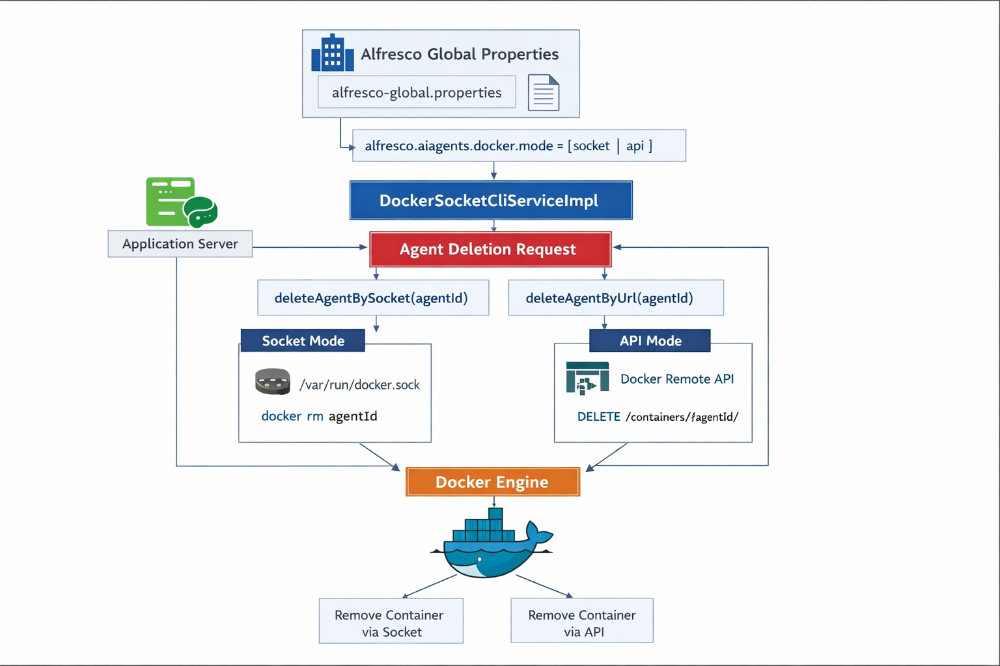

# Alfresco Community DockIA Agents

Este proyecto añade a Alfresco Content Services (ACS) un plugin que convierte Alfresco en el control plane para gestionar agentes de IA desplegados como contenedores Docker. El plugin expone una API REST para crear, listar, consultar y eliminar agentes, persistiendo su definición y estado en el propio repositorio de Alfresco (Agent Registry) para trazabilidad.


Al desplegar un agente, Alfresco valida la configuración, resuelve el nodo destino (NodeRef) y los secretRef definidos en alfresco-global.properties (por ejemplo la contraseña del usuario técnico svc_ai), e inyecta todo como variables de entorno en el contenedor (config Alfresco + proveedor LLM + prompt + env extra). El runtime Docker puede operar en dos modos configurables: socket local (CLI contra /var/run/docker.sock) o Docker Remote API con TLS. Cada agente queda registrado en Alfresco con su agentId, containerId, estados deseado/actual y la configuración sanitizada (sin secretos en claro).

## Arquitectura



## Configuración
1. Antes de poder crear agentes através de alfresco, primero tenemos que ejecutar el siguiente comando si utilizamos la modalidad socket, para saber el id con el que se está ejecutando en nuestro host:
```
stat -c '%g' /var/run/docker.sock
```

2. Si se utiliza la modalidad socket debemos de configurar nuestro docker-compose.yaml y nuestro Dockerfile. A continuación, se detalla dentro del proyecto los ejemplos:
```
docker/docker-compose.yml -> montamos como volúmen el socket de docker.

src/main/docker/Dockerfile -> Instalamos los comandos de docker y añadimos al usuario alfresco al id obtenido en el paso 1.
```

3. Configuramos las siguientes propiedades en alfresco-global.properties:
```
# Activa/desactiva integración Docker
alfresco.aiagents.docker.enabled=true
# Modo de integración docker: socket o remote (url)
alfresco.aiagents.docker.mode=socket
# Socket path (cuando mode=socket)
alfresco.aiagents.docker.socket=/var/run/docker.sock

# Legacy (se mantienen pero se ignoran si mode=socket)
# alfresco.aiagents.docker.baseUrl=https://dockerhost:2376
# alfresco.aiagents.docker.network=ai-agents
# alfresco.aiagents.docker.tls.keystore.path=/opt/alfresco/tls/docker-client.p12
# alfresco.aiagents.docker.tls.keystore.password=changeit
# alfresco.aiagents.docker.tls.truststore.path=/opt/alfresco/tls/docker-trust.p12
# alfresco.aiagents.docker.tls.truststore.password=changeit

# Secret placeholder (si usas auth basic desde el agente)
alfresco.aiagents.secret.svc_ai_password=supersecret

alfresco.aiagents.image.allowlist.enabled=false
# alfresco.aiagents.image.allowlist.enabled=true
# alfresco.aiagents.image.allowlist=cparedes/agents/,ghcr.io/miorg/,registry.local/
```

## Comandos de ejmplo para crear nuestro agente
1. Crear un agente, aparte de crear un contenedor con nuestro agente, también creará un nodo en alfresco en Repositorio> Data Dictionary> AI Agents:
```
   curl -u admin:admin   -X POST "http://localhost:8080/alfresco/s/api/-default-/public/ai-agents/versions/1/agents"   -H "Content-Type: application/json"   -d '{
       "name": "extract-metadata1",
       "image": "cparedes/agents/extract-metadata:1.0.0",
      "ports": [
        { "containerPort": 8080, "hostPort": 9090, "protocol": "tcp" }
      ],
      "alfresco": {
        "baseUrl": "http://localhost:8080/alfresco",
        "authType": "basic",
        "username": "svc_ai",
        "passwordSecretRef": {
           "secretRef": "prop:alfresco.aiagents.secret.svc_ai_password"
        },
         "targetNodeId": "workspace://SpacesStore/e8780cd0-fc42-4e44-b80c-d0fc42ee44b7",
        "pollingSeconds": 10
      },
      "llm": {
         "provider": "ollama",
         "baseUrl": "http://ollama:11434",
         "model": "llama3.1",
         "prompt": "Eres un agente que procesa documentos y deposita los resultados en el nodo destino."
       },
      "env": {
        "LOG_LEVEL": "info"
      }
    }'
```
**IMPORTANTE** La password se creará con la configuración que le hayamos puesto en alfresco-global.properties.

2. Comprobar que el contenedor se ha creado con la password correcta:
```
docker inspect 5576a9b3aeb5fc30ca9a3a1cfa09e6fd0a4abb5dcbcd33cf240e014ed866f17f \
  --format '{{range .Config.Env}}{{println .}}{{end}}' | grep ALFRESCO_PASSWORD
```

3. Listar los agentes que tenemos desplegados:
```
curl -u admin:admin \
  -H "Accept: application/json" \
  "http://localhost:8080/alfresco/s/api/-default-/public/ai-agents/versions/1/agents"
```

4. Obtener propiedades del agente:
```
curl -u admin:admin \
  -H "Accept: application/json" \
  "http://localhost:8080/alfresco/s/api/-default-/public/ai-agents/versions/1/agents/agent-6c00f331-342f-4658-9d00-02f3a7d0366a"
```

5. Eliminar un agente:
```
curl -u admin:admin -X DELETE \
  "http://localhost:8080/alfresco/s/api/-default-/public/ai-agents/versions/1/agents/agent-6c00f331-342f-4658-9d00-02f3a7d0366a"
```